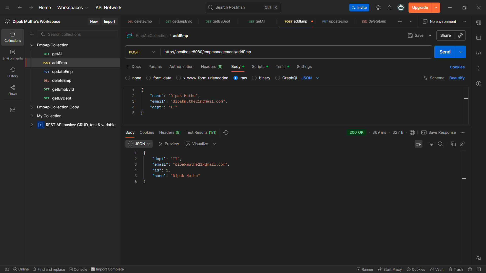
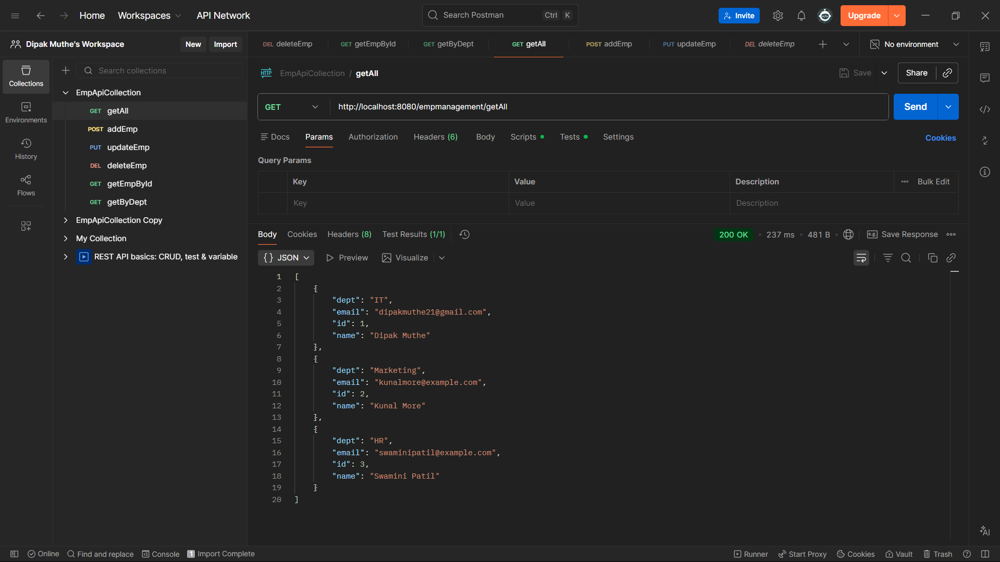
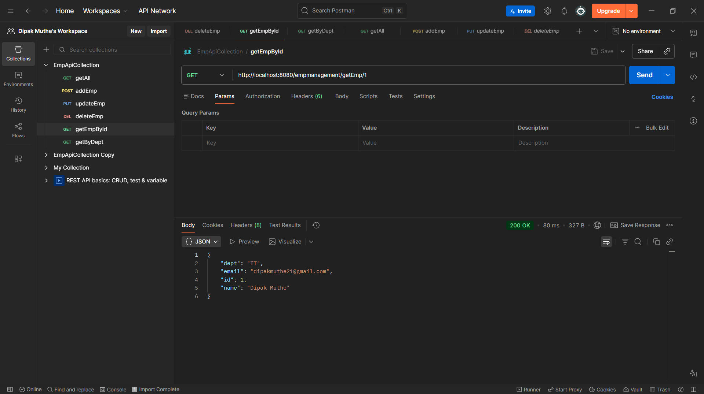
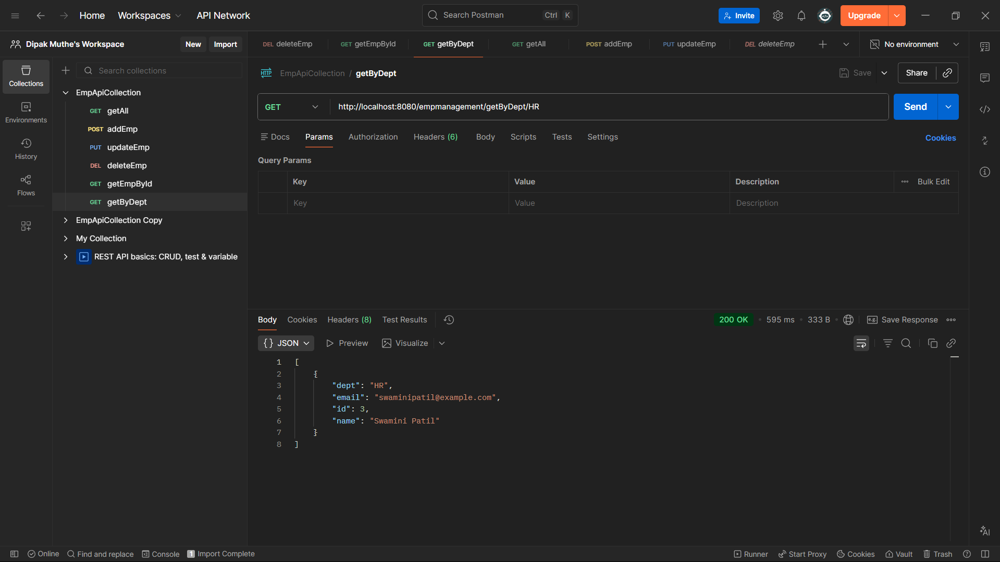
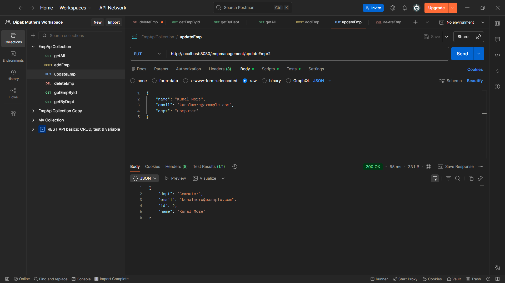
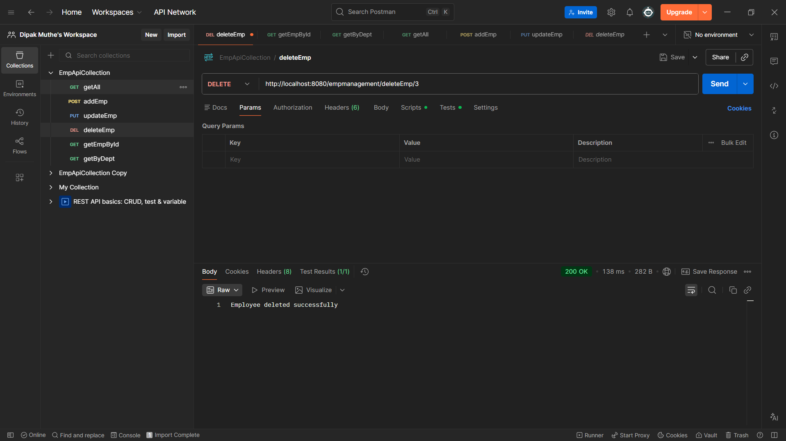

# 🚀 Employee Management System

## 📌 Project Overview

This is a Spring Boot REST API application to manage employees.
It allows performing CRUD operations and searching employees by department.

---

## 🛠️ Tech Stack

* Java
* Spring Boot
* MySQL
* Spring Data JPA
* REST APIs
* Postman

---

## 📂 Project Structure

```
EmployeeManagement/
│
├── src/
├── pom.xml
├── README.md
├── postman/
│   └── Employee-Management-System.postman_collection.json
└── screenshots/
    ├── AddEmployee.png
    ├── DisplayAllEmp.png
    ├── DisplayById.png
    ├── SearchbyDept.png
    ├── UpdateEmp.png
    └── DeleteEmp.png
```

---

## ⚙️ Setup & Run the Project

### 🔹 1. Clone Repository

```
git clone https://github.com/dipakmuthe/Firephoenixdev-Task.git
cd EmployeeManagement
```

---

### 🔹 2. Setup MySQL Database

Open MySQL and run:

```
CREATE DATABASE employee_db;
```

---

### 🔹 3. Configure application.properties

Go to:

```
src/main/resources/application.properties
```

Update:

```
spring.datasource.url=jdbc:mysql://localhost:3306/employee_db
spring.datasource.username=YOUR_USERNAME
spring.datasource.password=YOUR_PASSWORD

spring.jpa.hibernate.ddl-auto=update
spring.jpa.show-sql=true
spring.jpa.database-platform=org.hibernate.dialect.MySQL8Dialect

server.port=8080
```

---

### 🔹 4. Run the Application

#### 👉 Using Spring Tool Suite

* Right-click project
* Run As → Spring Boot App

#### 👉 Using Command Line

```
mvn spring-boot:run
```

---


---

## 🔗 API Endpoints

| Method | Endpoint                        | Description          |
| ------ | ------------------------------- | -------------------- |
| POST   | /empmanagement/addEmp           | Add Employee         |
| GET    | /empmanagement/getAll           | Get All Employees    |
| GET    | /empmanagement/getEmp/{id}      | Get Employee by ID   |
| PUT    | /empmanagement/updateEmp/{id}   | Update Employee      |
| DELETE | /empmanagement/deleteEmp/{id}   | Delete Employee      |
| GET    | /empmanagement/getByDept/{dept} | Search by Department |

---

## 📬 API Testing Using Postman

### 🔹 Import Collection

1. Open Postman
2. Click Import
3. Select:

```
postman/Employee-Management-System.postman_collection.json
```

---

### 🔹 Example Request (Add Employee)

POST `/empmanagement/addEmp`

```
{
  "name": "Dipak",
  "email": "dipak@gmail.com",
  "dept": "IT"
}
```

---

## 📸 API Testing Screenshots

### 🔹 Add Employee



---

### 🔹 Get All Employees



---

### 🔹 Get Employee by ID



---

### 🔹 Search by Department



---

### 🔹 Update Employee



---

### 🔹 Delete Employee



---

## 📌 Notes

* Make sure MySQL server is running
* Update database username & password correctly
* Default port: 8080

---

## 👨‍💻 Author

Dipak Muthe
